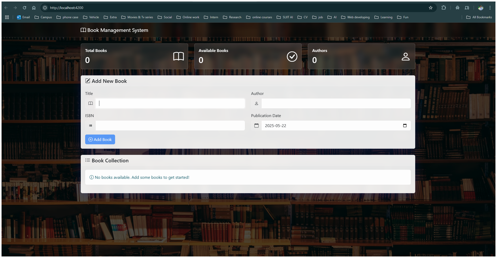
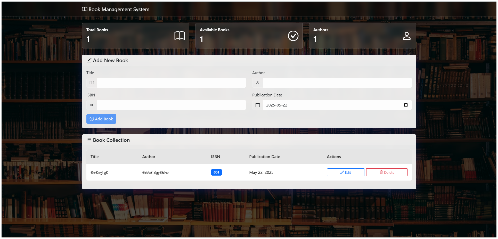

# 📚 Simple Book Management System

A full-stack web application that allows users to manage a collection of books — built with **Angular** on the frontend and **ASP.NET (C#)** on the backend.

---

## 🎯 Objective

To create a simple and intuitive application where users can:
- Add 📘
- View 👁️
- Edit ✏️
- Delete ❌

...books through a user-friendly interface.

---

## 🧰 Technologies Used

| Frontend | Backend | Other |
|----------|---------|-------|
| Angular  | ASP.NET (C#) | HTML, CSS, JavaScript |

---

## 🧱 Project Structure

/enhanzer 
  │ 
  ├── frontend/ # Angular app 
  │ ├── src/ 
  │ └── ... 
  │ 
  ├── backend/ # ASP.NET API 
  │ ├── Controllers/ 
  │ ├── Models/ 
  │ └── ... 
  │ 
  └── README.md 

------------------------------------------------------------------------------------------------------------------------------------------------------------------------------------------

## 🔧 Features

### 🔹 Frontend (Angular)
- 📄 Displays a list of books
- ➕ Add new books through a form
- 📝 Edit existing books
- ❌ Delete books

### 🔹 Backend (ASP.NET with C#)
- 🔁 RESTful API for full CRUD operations
- 💾 Uses a simple **in-memory list** to store book data
- 📦 Book model includes:
  - `id`
  - `title`
  - `author`
  - `isbn`
  - `publicationDate`

------------------------------------------------------------------------------------------------------------------------------------------------------------------------------------------

## 🚀 Getting Started

### 📦 Backend (ASP.NET)

- `cd BookApi`
- `dotnet build`
- `dotnet run`  
-The backend will start on: http://localhost:5011/api/books  

### 🎨 Frontend (Angular)

- `cd BookFrontend`
- `npm install`
- `ng serve`  
-The Frontend will start on: http://localhost:4200/  

### 🧪 Sample Book JSON

{ 
  "id": 1, 
  "title": "Clean Code", 
  "author": "Robert C. Martin", 
  "isbn": "9780132350884", 
  "publicationDate": "2008-08-11" 
} 

### 📌 Future Improvements
- Integrate a database like SQL Server or MongoDB
- Add search and pagination
- Implement user authentication
- Enhance UI with Angular Material

### 💡 Author

👨‍💻 Oditha Chamika Bandara Herath 
📘 GitHub | 🎓 SLIIT<be>

 
 <be>

